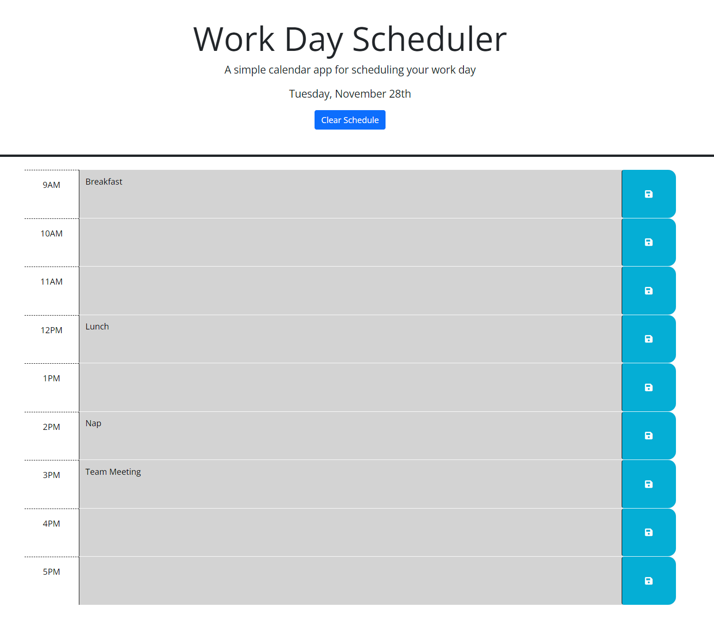

# 05-work-day-scheduler

## Description

html, css and js for work day scheduler

## Usage

Text areas can be typed in. When save button on right of containers are clicked, text is saved to local storage and persisted.  
Date is displayed in header above clear button which clears local storage.  
Hour blocks are color coded if they are before or after the current time dynamically.

https://treblotnad.github.io/05-work-day-scheduler/

## Credits

Starter code is from UofM bootcamp week 5.

## License

Please refer to the License in the repo.
